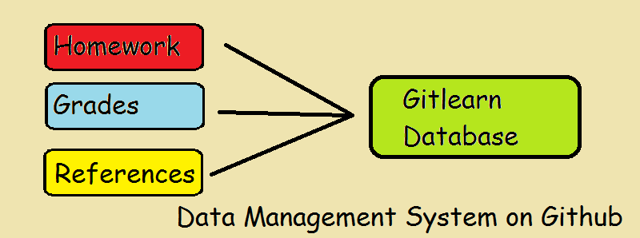
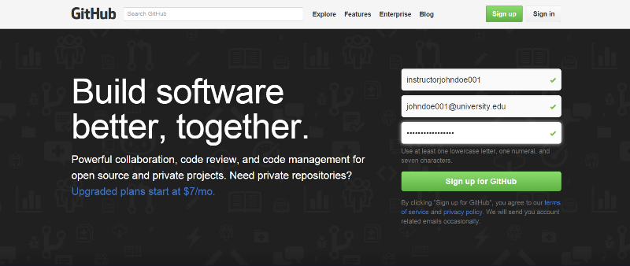
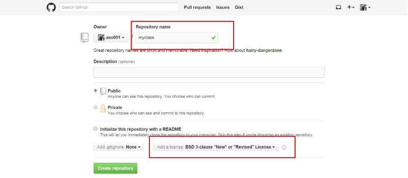
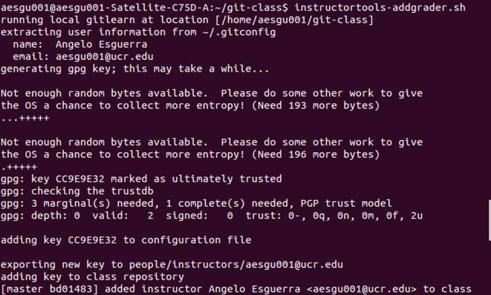
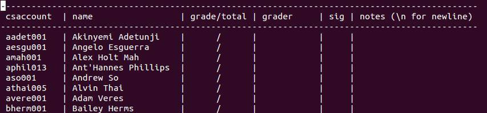
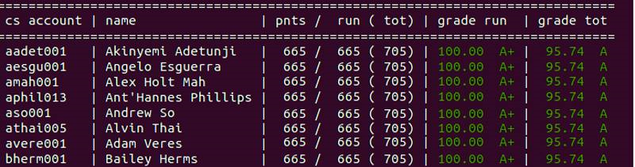

#Setup a Database for Your Class with Gitlearn

This is a common database software that instructors would use regularly.
This information covers how to setup your own data management system that would hold student grades, homework assignments, and textbook references for your class.
This software should be run on a Linux or Mac based machine.



###Installing Procedures

#####Step 1: Register a new account on Github.

- You may skip this step if you already have a Github account.
- To create a new account, you need to fill out a signup form with your USERNAME, EMAIL ADDRESS, and PASSWORD after clicking on the following link: [github.com](https://github.com).
- Once you finish registering your personal information, click on the big green "Sign up for Github" button.



#####Step 2: Create a database on Github with your class name.

- On the top right hand corner,  
  a.) Click on the '+' sign to bring down the selection menu.  
  b.) Click on the `New Respository` button with the pull-down menu.

  

- Type in the name of your class in the 'Respository name' section such as "myclass" or "ucla-ENGL1C".
- Set 'BSD 3-clause' in the 'Add a license' section for more flexibility.

 

#####Step 3: Build a mirror image of your database to your local machine.

- Open up a local terminal.
- Type the following commands in sequence:
```
$ git clone https://github.com/instructorjdoe001/myclass
$ cd myclass
$ git clone https://github.com/mikeizbicki/gitlearn
$ echo "export PATH=$(pwd)/gitlearn/scripts:"'$PATH' >> $HOME/.bashrc
```

#####Step 4: Configure your Gitlearn settings with your class name.

Use the following commands to change the label from `classname="ucr-cs100"` to `classname="yourclassname"`.
```
$ cd gitlearn/scripts
$ sed -i -e 's/ucr-cs100/yourclassname/' ./config.sh
```

#####Step 5: Setup directory folders for your class.

```
$ cd -
$ mkdir assignments
$ mkdir people
$ cd people
$ mkdir students
$ mkdir instructors
```

#####Step 6: Sychronize your local database with Github.

```
$ git add --all
$ git commit -m "Initial Classroom commit"
$ git push origin
```

#####Step 7: Create assignment folders in your database.

After setting up your classroom database, you can make assignment directories store grades for the class.
For example, you can run the following commands in the `assignments`' directory folder.
```
$ mkdir assn1
$ cd assn1
$ echo /100 >> grade
$ touch README.md
$ git add --all
$ git commit -m "Adding assn1"
$ git push origin
```
**NOTE:**
- You can add subfolders into the `assignments` directory for different categories, such as labs.
- You can change an assignment's total grade in this directory.

#####Step 8: Add instructor verification keys

You should add instructor keys to verify student grades.
On the home directory of the class database, run:
```
$ instructortools-addgrader.sh
```


**NOTE:**
This process takes more than 15 minutes to complete.  

**IMPORTANT:**
Make sure the key is generated in the computer that you always use because the key is part of verification system.

###Congratulations! You have completed a basic database setup.
----------------------------------------------------------------------------------------
#Operating the Gitlearn Database:

###Update Assignment Grades
The `gradeassignment-all.sh` script lets you update the assignment grade for the whole class.
The script requires an appropiate assignment subpath as a parameter.
You would run the following command:
```
$ gradeassignment-all.sh assignments/assn1/
```
**NOTE:** The script will pull a local copy of each student's database and check for the existence of the assignment.
It will be opened up with a vim editor to edit individual student grades on a spreadsheet like this:



**NOTE:**
The spreadsheet will show if the assignment was previously graded and signed.
After saving the score on the editor, the script will look for the instructor key to verify and sign the commit.
The updated grades will then be pushed to each student database.

###Grade Individual Assignments
The `gradeassignment-individual.sh` script grades an assignment for a specific student.
It requires two parameters: the student's Github account and the assignment subpath.
```
$ gradeassignment-individual.sh jdoe001 assignments/assn1/
```
Like the `gradeassignment-all.sh` script, this script will also pull a local copy of the student's database and check whether the assignment exists.
However, it has an added feature that lets the grader provide the student with feedback.
It will be opened up with a blank page in the vim editor for changing student grades.
The script will automatically push the updated grade to the student's database.

###View Grades
To view all student grades, run:
```
$ instructortools-viewallgrades.sh
```
This script will pull local copy of each student database and display all the names and the overall scores in a table.



To check the grade of an individual student, the following script should be used:
```
$ calcgrade.sh jdoe001
```
**NOTE:**
If you run the `instructortools-viewallgrades.sh` script for the first time, the script will need to clone a local database of each student.  
In addition, you will have to run the script again to eliminate the incorrect grades that appear after the first run.


###Additional Tools/Resources

[`runtests.md`](runtests.md) - semi-automatic grading script  
[`grades.md`](grades.md) - detailed explanation on how grades in gitlearn work
